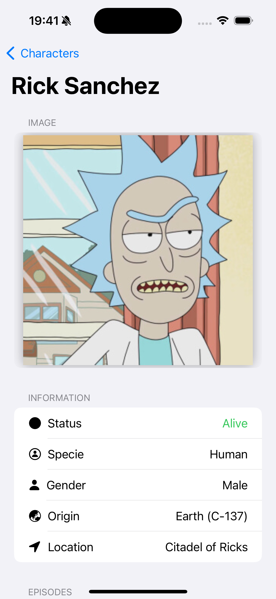

# Rick And Morty Library

Aplicación que muestra un listado de personajes de Rick and Morty y su detalle, que da una información completa del personaje elegido. Esta construida usando [The Rick and Morty API](https://rickandmortyapi.com/).
 
1. [Capturas](#capturas)
2. [Conociendo el proyecto](#conociendo_el_proyecto)
3. [Stack tecnológico](#stack_tecnologico)
4. [Requisitos](#requisitos)
5. [Instalación](#Instalacion)
6. [Autor](#autor)

<h2 id="capturas">Capturas</h2>

| Lista de personajes | Lista de personajes | Detalle del personaje | Detalle del personaje |
| ----------- | ------------ | ------------ | ------------
|  | .png) |  |  |

<h2 id="conociendo_el_proyecto">Conociendo el proyecto</h2>

Al ejecutar la aplicación, se realiza una petición que devuelve algunos personajes, la respuesta se almacenan en un array, el cual, se usa en la vista para ver una lista completa de personajes de Rick and Morty, en la cual se puede observar:

- La imagen 
- El nombre
- El estado

Si se hace scroll para observar mas personajes, cuando llega al final de la lista, se actualiza para realizar una nueva petición a la siguiente página para poder cargar mas personajes. 

Si se pulsa sobre algún personaje, se redirige a la vista de detalle, en la cual se sirve de la información de la anterior pantalla para mostrar la imagen, la información del personaje y el nombre de los episodios en los que aparece. 

Para poder mostrar los episodios, se instancia el viewModel de detalle y se envía a su vista, con las URLs de los episodios. Este viewModel, se inicializa con un array que almacena todas las URLs de los episodios en los que aparece el personaje pulsado. Este array, se va recorriendo y se va realizando peticiones al endpoint que devuelve la información de un solo episodio, la información recibida se almacena en una propiedad, la cual, se almacena en un nuevo array que es utilizado en la vista.

Esta aplicación esta construida usando:

- Arquitectura MVVM
- Async/Await

<h2 id="stack_tecnologico">Stack Tecnologico</h2>

- Swift 5.9
- Xcode 15.0.1
- SwiftUI 

<h2 id="requisitos">Requisitos</h2>

- iOS 14.0 o superior
- Xcode 12.0 o superior

<h2 id="Instalacion">Instalación</h2>

1. Clona el repositorio
2. Abra el proyecto
3. Abra el archivo `RickAndMortyLibrary.xcodeproj` y ejecute la app. 

<h2 id="autor">Autor</h2>

**Andres Aleu :v:** 

andresaleunz@gmail.com

[Linkedin](https://www.linkedin.com/in/andres-aleu-nu%C3%B1ez-/)

